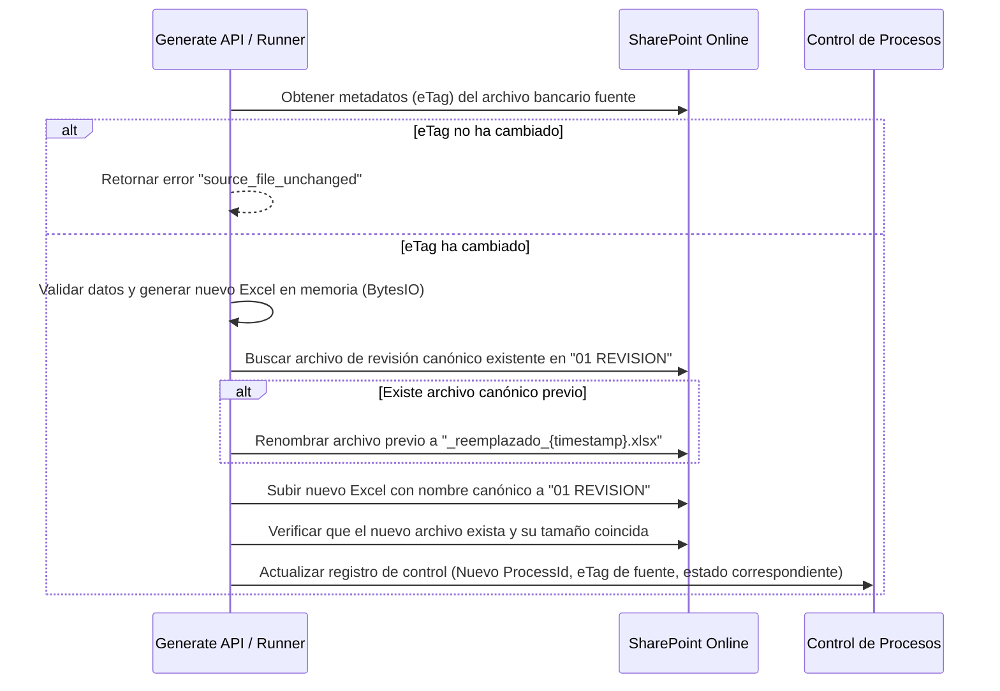

# Exploration: retry-payment-validation-with-errors

Análisis profundo de la gestión del reintento del endpoint Generate cuando el Excel de revisión se genera correctamente pero contiene registros en la hoja `Errores`.

## Current State

Actualmente, el endpoint `/generate/queue` y su caso de uso `generate_payment_validation` generan un archivo Excel de revisión en la carpeta `01 REVISION`. Si se encuentran errores de validación (por ejemplo, extractos faltantes o tablas de amortización no legibles), el job termina en estado `completed` (exitoso) y escribe dichos errores en la hoja `Errores`.
Sin embargo, el sistema presenta limitaciones críticas en la gestión del reintento y la idempotencia:
1. **Idempotencia ciega por clave de proceso**: El sistema calcula `process_key` únicamente en función del banco y la fecha (`payment-validation|{bank_code}|{process_date}`). Si se vuelve a ejecutar `Generate` con el mismo banco y fecha, el sistema detecta que el proceso ya existe y retorna el archivo anterior sin realizar ninguna nueva comprobación ni regeneración, ignorando por completo si el archivo bancario fuente fue corregido.
2. **Ignora el parámetro `force`**: Aunque el esquema `GenerateRequest` define `force: bool = False`, el router HTTP lo ignora y no lo propaga al caso de uso, por lo que no hay forma de forzar la regeneración.
3. **El estado de control oculta los errores**: El control por banco se actualiza al estado `REVISION_CREADA` y el job de API devuelve una severidad de `success`, sin discriminar si la hoja `Errores` contiene registros bloqueantes.
4. **Finalize no lee la hoja `Errores`**: El endpoint `Finalize` no tiene ninguna validación sobre la hoja `Errores` y permite finalizar procesos que contienen inconsistencias críticas no corregidas.

---

## 1. Auditoría del comportamiento actual de Generate

El flujo exacto desde el POST hasta la respuesta del job es el siguiente:
1. **POST `/generate/queue`**: Se recibe la solicitud con `bank_code` y `process_date` en el body.
2. **Validación de Parámetros**: Se valida el código de banco (`banco_bogota` o `banco_bancolombia`) y que la fecha de proceso sea válida en formato ISO (`YYYY-MM-DD`).
3. **Control de Concurrencia (Lock)**: Se invoca `JobManager.try_start_generate()`. Si ya hay una generación o finalización activa en memoria, se responde inmediatamente con `409 Conflict`.
4. **Encolado**: Se crea un Job UUID con estado `queued` en el gestor de jobs en memoria y se añade la tarea en segundo plano `_run_generate_job`. Se responde `202 Accepted` con el `job_id`.
5. **Ejecución del Runner**: La tarea en segundo plano cambia el estado del job a `running` y ejecuta `generate_payment_validation`.
6. **Idempotencia Inicial**: Se obtiene el control de procesos del banco en SharePoint (`00 CONTROL`).
   - Si `snap.process_key == process_key` y existe `snap.validation_file_path`, el proceso se considera **ya generado**. Retorna de inmediato la información anterior, estableciendo `already_generated = True` y `file_action = "reused"`. **No lee ni procesa el archivo bancario**.
7. **Detección de Proceso Activo**: Si hay un proceso activo en control (`snap.is_active` es `True` y su estado no es terminal: `VACIO`, `CONSOLIDADO`, `MERGE_PARCIAL`, `AMORTIZACION_APLICADA` o errores) para un `process_key` diferente, falla con `ValueError("active_process_exists|...")`.
8. **Validación de Carpeta Vacía**: Se leen los elementos de `01 REVISION`. Si la carpeta contiene archivos que no empiecen con `~$`, falla con `ValueError("review_folder_not_empty")`.
9. **Descarga del Archivo Bancario**: Descarga el Excel original desde `00 CONTROL` (ej. `BANCO_BOGOTA.xlsx`).
10. **Lectura y Validación de Estructura**: Se localiza la fila de cabecera y se mapean las columnas. Se valida la existencia única de la columna `Tipo Aplicación`. Si falta o está duplicada, falla con error `tipo_aplicacion_column_missing` o `tipo_aplicacion_column_duplicate`.
11. **Procesamiento de Filas**: Se recorren las filas operativas. Si una fila carece de `Tipo Aplicación` o contiene un valor inválido (diferente a `PAGO`, `PAGO Y ABONO CAPITAL`, `ABONO CAPITAL`, `ABONO MORA`), falla inmediatamente con `tipo_aplicacion_required` o `tipo_aplicacion_invalid`.
12. **Búsqueda de Créditos y Extractos**: Para cada pago/abono, se mapea el concepto con las carpetas de cliente en `03 CLIENTES`.
    - Si la carpeta de cliente está duplicada o no existe, se captura la excepción y se añade un registro en `error_records`.
    - Si se encuentra la carpeta, se buscan subcarpetas de créditos (`CREDITO #`).
    - Para pagos: se localiza el PDF del extracto (en la subcarpeta `EXTRACTOS` o en la raíz del crédito) evaluando la fecha de vencimiento máxima. Se valida contra la tabla de amortización Excel. Cualquier fallo (extracto no encontrado, fecha no legible, monto no leído) genera una fila en `error_records` y **evita** la creación de un candidato de distribución en las hojas de pagos.
13. **Generación del Workbook**: Se crea un nuevo libro con openpyxl. Se escriben las hojas `Control`, `Resumen`, `Casos_Pago`, `Distribucion_Pagos`, `Listas` (oculta), `Distribucion_Abonos` y `Errores` (esta última con las filas de `error_records`).
14. **Subida del Workbook**: El libro se guarda en memoria y se sube a `01 REVISION/validacion_pagos_{banco}_{fecha}.xlsx`.
15. **Actualización del Control**: Se actualiza la fila de control del banco estableciendo `EstadoProceso = "REVISION_CREADA"`, `IsActive = True`, `LastCompletedStep = "GENERATE"` y `LastStepStatus = "COMPLETED"`.
16. **Finalización del Job**: El runner cambia el estado del job en memoria a `completed` y almacena el resultado. El lock de `JobManager` se libera en el bloque `finally`.

---

## 2. Confirmación del comportamiento ante errores en la hoja Errores

1. **¿Generate termina como `completed` cuando existen errores?**
   **Sí**. El flujo captura las excepciones dentro del bucle de transacciones, escribe los detalles en `error_records` para rellenar la hoja `Errores`, y continúa exitosamente hasta subir el Excel y marcar el job como `completed`.
2. **¿Qué `severity`, `user_message` y `next_action` devuelve?**
   - **`severity`**: `"success"` (siempre que el job termine sin excepciones generales no controladas, ignorando si la hoja `Errores` está llena).
   - **`user_message`**: El mensaje estándar `"Se generó el archivo de revisión del día. Ya puede abrirlo en la carpeta 01 REVISION de SharePoint."` (o el de abonos si detecta abonos, pero sin mención a errores técnicos).
   - **`next_action`**: El mensaje estándar `"Abra ese Excel, complete Distribucion_Pagos..."`.
3. **¿Qué estado se escribe en el control?**
   `"REVISION_CREADA"` en el campo `EstadoProceso` de la fila del banco.
4. **¿Se guarda el número de errores en el control?**
   **No**. La fila de control no almacena el conteo de errores; solo se reporta en el JSON del resultado del job (`summary.errores`) y en la hoja `Errores` del Excel generado.
5. **¿Finalize puede ejecutarse sobre un workbook con errores?**
   **Sí**. Si el usuario edita la hoja `Control` del Excel para establecer `Procesar = SI` y `Estado = EN_REVISION`, y completa los estados de pago en la hoja `Distribucion_Pagos`, el endpoint `Finalize` se ejecutará.
6. **¿Existe una validación que bloquee Finalize?**
   **No**. `Finalize` no interactúa en ningún momento con la hoja `Errores` ni realiza comprobaciones sobre ella.
7. **¿Una segunda llamada a Generate devuelve `active_process_exists`?**
   **No**, siempre y cuando sea para el **mismo** banco y fecha (`process_key` idéntico). El sistema detectará la coincidencia en la idempotencia inicial y retornará exitosamente el resultado anterior sin regenerar.
8. **¿Devuelve `already_generated`?**
   **Sí**, devuelve `"already_generated": true` en el payload JSON.
9. **¿Sobrescribe el workbook anterior?**
   **No**. Retorna inmediatamente en la validación de idempotencia inicial sin realizar escrituras.
10. **¿Crea otro workbook?**
    **No**.
11. **¿El parámetro `force` evita el bloqueo?**
    **No**. El parámetro `force` de la solicitud HTTP no se utiliza ni se propaga en el código.
12. **¿`force` puede provocar duplicados o pérdida de evidencia?**
    Actualmente no tiene efecto. En caso de implementarse de manera simple (borrando y sobrescribiendo el archivo directamente), sí provocaría la pérdida de cualquier anotación o corrección manual que el usuario ya hubiera hecho sobre el Excel en `01 REVISION`.

### Matriz de Escenarios Reales

| Estado Inicial en Control | Same ProcessKey? | Carpeta 01 REVISION Vacía? | Resultado de la Invocación a Generate | Estado Final en Control |
| :--- | :--- | :--- | :--- | :--- |
| `VACIO` / Ninguno | N/A | Sí | **Éxito (Genera archivo)** | `REVISION_CREADA` |
| `VACIO` / Ninguno | N/A | No (archivos huérfanos) | **Error (`review_folder_not_empty`)** | Sin cambios |
| `REVISION_CREADA` | **Sí** | No (contiene la revisión) | **Éxito Idempotencia (retorna archivo guardado)** | `REVISION_CREADA` |
| `REVISION_CREADA` | **No** | No | **Error (`active_process_exists`)** | Sin cambios |
| `FINALIZADO` | **Sí** | No | **Éxito Idempotencia (retorna archivo guardado)** | `FINALIZADO` |
| `FINALIZADO` | **No** | No (archivos huérfanos) | **Error (`review_folder_not_empty`)** | Sin cambios |

---

## 3. Auditoría del significado de la hoja Errores

A continuación se listan e inventarian todos los códigos que pueden registrarse en la hoja `Errores`. En el flujo actual de selección de extracto por fecha máxima (V2, por defecto), la falta de tabla de amortización o su mal formato no bloquea la generación del caso en las hojas de distribución; en su lugar, se genera el caso con una advertencia en la columna `Observación extra`. Los errores que sí van a la hoja `Errores` impiden la creación de filas de distribución para esa transacción bancaria específica.

### Inventario de Códigos de Error

| Código de Error | Origen en Código | Entidad Afectada | Corrige Excel? | Corrige SharePoint? | Soporte Técnico? | ¿Debería Impedir Finalize? | ¿Desaparece al Regenerar? | Clasificación |
| :--- | :--- | :--- | :--- | :--- | :--- | :--- | :--- | :--- |
| `customer_not_found` | `generate_payment_validation` | Cliente / Transacción | Sí (si el concepto del banco está mal) | Sí (crear o renombrar la carpeta del cliente en `03 CLIENTES`) | No | Sí | Sí | `BLOCKING_INPUT_ERROR` |
| `customer_ambiguous` | `generate_payment_validation` | Cliente / Transacción | Sí (hacer concepto más exacto) | Sí (eliminar carpetas duplicadas o similares en `03 CLIENTES`) | No | Sí | Sí | `BLOCKING_INPUT_ERROR` |
| `credit_folder_not_found` | `_load_credit_candidates` | Crédito / Cliente | No | Sí (crear carpeta del crédito con nombre estándar `CREDITO #` del cliente) | No | Sí | Sí | `BLOCKING_INPUT_ERROR` |
| `extract_not_found` | `_load_credit_candidates` | Crédito / Extracto | No | Sí (subir PDF del extracto a la carpeta del crédito o `EXTRACTOS`) | No | Sí | Sí | `BLOCKING_INPUT_ERROR` |
| `fecha_limite_extracto_not_readable` | `_load_credit_candidates` | Crédito / Extracto | No | Sí (reemplazar por un PDF del extracto digital válido y legible) | Sí (si cambió el formato de extracto del banco) | Sí | Sí | `BLOCKING_INPUT_ERROR` |
| `extract_amount_not_found` | `_load_credit_candidates` | Crédito / Extracto | No | Sí (reemplazar por un PDF legible con valor 'Total a pagar' visible) | Sí (si cambió el formato del PDF) | Sí | Sí | `BLOCKING_INPUT_ERROR` |
| `extract_tie_max_fecha_limite` | `_load_credit_candidates` | Crédito / Extracto | No | Sí (dejar un solo PDF con la fecha de vencimiento máxima) | No | Sí | Sí | `BLOCKING_INPUT_ERROR` |
| `abono_no_credit_candidates` | `generate_payment_validation` | Abono / Cliente | No | Sí (asegurar que existan carpetas de crédito con tablas de amortización) | No | Sí | Sí | `BLOCKING_INPUT_ERROR` |
| `abono_credit_without_amortization_table` | `_load_credit_candidates_for_abono` | Abono / Crédito | No | Sí (subir Excel de tabla de amortización a la carpeta del crédito) | No | Sí | Sí | `BLOCKING_INPUT_ERROR` |
| `abono_mora_extract_missing` | `_load_credit_candidates_for_abono_mora` | Abono Mora / Crédito | No | Sí (subir extracto de referencia a la carpeta del crédito) | No | Sí | Sí | `BLOCKING_INPUT_ERROR` |
| `abono_mora_extract_ambiguous` | `_load_credit_candidates_for_abono_mora` | Abono Mora / Crédito | No | Sí (dejar un único extracto de referencia con la fecha máxima) | No | Sí | Sí | `BLOCKING_INPUT_ERROR` |

*Nota:* El código `generic_abono_not_supported` es un fail-fast a nivel de lectura del Excel del banco que detiene por completo la ejecución y lanza una excepción general, por lo que no llega a escribir una fila en la hoja de Errores.

---

## 4. Auditoría de la versión del archivo fuente

Actualmente, el sistema **no recupera ni utiliza metadatos** del archivo original del banco en SharePoint para control de cambios. El flujo simplemente llama a `client.get_bytes()` en el path del archivo configurado sin consultar previamente las propiedades del objeto `DriveItem`.

### Metadatos Disponibles en Microsoft Graph
Al realizar una petición `GET` sobre el elemento del archivo bancario en SharePoint (ej. `/sites/{site_id}/drives/{drive_id}/root:/{encoded_path}`), Graph API devuelve un objeto JSON con los siguientes metadatos utilizables:
- **`id`**: ID único persistente del archivo en la base de datos de SharePoint.
- **`eTag`**: Token de versión único (ej. `"{UUID},4"`). Cambia cada vez que el contenido o propiedades del archivo se modifican.
- **`lastModifiedDateTime`**: Fecha y hora de la última modificación (timestamp ISO 8601).
- **`size`**: Tamaño del archivo en bytes.
- **`file.hashes.quickXorHash`**: Un hash criptográfico optimizado provisto nativamente por SharePoint Online para verificar integridad del contenido sin descargar el archivo.

### Capacidad de Distinción de Generate con eTag/Metadatos
Implementando el almacenamiento de metadatos (especialmente el `eTag`), el sistema puede distinguir:
- **Misma fuente sin cambios**: El `eTag` actual del archivo coincide con el guardado en la corrida anterior.
- **Misma ruta con contenido corregido**: El path es idéntico pero el `eTag` actual es diferente del guardado, indicando que el archivo fue modificado.
- **Archivo nuevo con mismo nombre**: El `id` y `eTag` de SharePoint diferirán del histórico si el archivo fue eliminado y vuelto a subir como un objeto nuevo.
- **Archivo nuevo para el mismo banco y fecha**: Si se cambia la parametrización de rutas, el `id` o `file_path` almacenado diferirá.

*Conclusión*: El **`eTag`** obtenido de SharePoint es la metadata más eficiente, segura y estándar para implementar control de versiones del archivo original sin incurrir en la descarga y hash manual del archivo.

---

## 5. Auditoría de la idempotencia actual

La idempotencia actual está diseñada en torno a la clave de proceso única:
`process_key = payment-validation|{bank_code}|{process_date}`

### Análisis de Limitaciones
- **Dependencia exclusiva**: Depende únicamente del código del banco y de la fecha de proceso.
- **Sin control de versión**: No tiene en cuenta si el archivo bancario fuente ha sido modificado.
- **Reuso estático**: Si ya existe un registro con ese `process_key` en el control de SharePoint y cuenta con un path de validación, la API devuelve siempre el primer resultado sin recalcular.
- **Bloqueo tras corrección**: Si el usuario corrige errores en el archivo original de `00 CONTROL` para corregir fallas de validación, la idempotencia le impide generar una nueva revisión de forma natural (debe eliminar manualmente la corrida en SharePoint o esperar un cambio de fecha).
- **Confusión de correcciones**: Confunde una corrección de datos con un duplicado, bloqueando al usuario en el primer resultado erróneo obtenido.

---

## 6. Auditoría de estados del control

El sistema bloquea una nueva ejecución de `Generate` para un `process_date`/`bank_code` **diferente** si existe un proceso activo en el control del banco.

### Inventario de Estados Bloqueantes
Los estados que se consideran **activos** y que, por tanto, bloquean la ejecución de un nuevo Generate para otra fecha son todos aquellos que **no** forman parte del conjunto de estados terminales:

$$\text{terminal} = \{\text{VACIO}, \text{CONSOLIDADO}, \text{MERGE\_PARCIAL}, \text{AMORTIZACION\_APLICADA}, \text{ERROR\_GENERATE}, \text{ERROR\_FINALIZE}, \text{ERROR\_NOTIFY}, \text{ERROR\_MERGE}, \text{ERROR\_APPLY}\}$$

- **`REVISION_CREADA`**: Estado activo. Bloquea un nuevo Generate para otra corrida.
- **`FINALIZADO`**: **Estado activo**. Curiosamente, `FINALIZADO` no está en la lista de estados terminales, por lo que bloquea ejecuciones de Generate en otras fechas hasta que el proceso completo avance a una etapa terminal.
- **`PENDIENTE_ASIENTOS`**: Estado activo. Bloquea.
- **`AMORTIZACION_PARCIAL`**: Estado activo. Bloquea.

### Evaluación del Nuevo Estado `REVISION_REQUIERE_CORRECCION`
Este estado representará un proceso generado que completó su ejecución de forma exitosa pero contiene **errores bloqueantes** en la hoja `Errores`. Su comportamiento conceptual debe ser:
- **Permite**:
  1. Consultar el estado del job.
  2. Corregir el archivo fuente del banco en SharePoint.
  3. Ejecutar nuevamente `Generate` (el sistema detecta el cambio de `eTag` y recrea el workbook).
- **Bloquea**:
  1. Finalize (el endpoint de finalización debe rechazar la operación si el estado del control es `REVISION_REQUIERE_CORRECCION`).
  2. Notify, Merge, Dry-run y Apply.

---

## 7. Evaluación de la solución robusta propuesta

La política propuesta para la solución de reintentos es adecuada y aborda de forma robusta las necesidades del negocio:

1. **Generación con cero errores bloqueantes**:
   - Escribe el estado `REVISION_CREADA` en el control.
   - Si se reintenta sin cambios en la fuente, devuelve idempotencia (reutiliza).
   - Se permite `Finalize` normalmente.
2. **Generación con errores bloqueantes**:
   - Escribe el estado `REVISION_REQUIERE_CORRECCION` en el control.
   - La API devuelve severidad `warning` en el job (aunque el job esté `completed`), avisando explícitamente al usuario de la existencia de errores bloqueantes en el Excel.
   - Se bloquea la llamada a `Finalize` (evitando arrastrar datos rotos).
   - `Generate` permite ser reintentado libremente siempre que el archivo fuente haya sido modificado.
3. **Reintento sin cambios en el archivo fuente**:
   - No genera otro workbook ni sobrescribe el anterior.
   - Retorna código `source_file_unchanged` y solicita explícitamente al usuario corregir el reporte del banco original.
4. **Reintento con archivo fuente modificado**:
   - El sistema detecta el cambio de `eTag` del archivo del banco.
   - Genera un nuevo workbook versionado.
   - Actualiza el control a `REVISION_CREADA` (si ya no hay errores) o `REVISION_REQUIERE_CORRECCION`.
   - Se conserva el workbook anterior renombrándolo (ej. en una subcarpeta o con sufijo de reemplazo).
5. **Proceso ya avanzado**:
   - Si el estado en control es `FINALIZADO` o posterior, no se permite ninguna regeneración ni sobreescritura de revisiones antiguas, exigiendo el flujo estándar de cancelación o cierre.

---

## 8. Evaluación de versionado de workbooks

Se comparan las tres alternativas de versionado para los archivos de revisión generados:

### Alternativas de Versionado

| Dimensión | Opción A — Sobrescribir | Opción B — Versiones con Sufijo | Opción C — Nombre Canónico + Archivar Anterior (Recomendada) |
| :--- | :--- | :--- | :--- |
| **Pérdida de evidencia** | Alta (se pierde el workbook anterior y sus metadatos) | Ninguna (todos los archivos persisten) | Ninguna (los archivos anteriores se guardan renombrados) |
| **Confusión del usuario** | Baja (un solo archivo visible) | Alta (múltiples archivos `_r1`, `_r2` en la carpeta `01 REVISION`) | Baja (un solo archivo activo en `01 REVISION`; los antiguos se mueven/renombran) |
| **Compatibilidad con Finalize**| Total (busca el nombre fijo) | Baja (Finalize debe adivinar o recibir la versión exacta) | Total (busca el nombre fijo activo en la carpeta) |
| **Cambios en Power Automate** | Ninguno | Requiere pasar parámetros de versión | Ninguno |
| **Colisión por archivo abierto**| Alta (falla si el usuario tiene el Excel abierto) | Baja (crea un archivo con nuevo nombre) | Baja (se renombra el anterior en SharePoint antes de subir el nuevo) |
| **Complejidad de implementación**| Baja | Media | Media-Baja (renombrado simple vía Graph API) |

### Recomendación y Justificación
Se recomienda la **Opción C**. 
Al renombrar la versión anterior en SharePoint antes de subir la nueva (ej. de `validacion_pagos_banco_bogota_2026-06-17.xlsx` a `validacion_pagos_banco_bogota_2026-06-17_reemplazado_{timestamp}.xlsx` o similar), logramos:
1. **Evitar colisiones**: Si el usuario dejó abierto el Excel anterior en Excel Online, Graph API suele permitir renombrarlo o moverlo, liberando la ruta del nombre canónico para subir el nuevo archivo sin que la subida falle por bloqueo de escritura.
2. **Preservar evidencia**: El archivo reemplazado queda almacenado como registro de auditoría de los intentos previos.
3. **No romper nada**: Power Automate y `Finalize` siguen apuntando al archivo canónico activo sin alterar sus configuraciones de rutas.

---

## 9. Evaluación de publicación segura

Diseño conceptual de la publicación del nuevo workbook tras una corrección:

### Gestión de Fallos en el Proceso
- **Fallo en Generación en memoria**: El proceso se detiene antes de tocar SharePoint. No hay cambios. El archivo anterior sigue siendo el vigente y el control no se altera.
- **Fallo en Renombrado/Mover el anterior**: La API Graph rechaza la operación. Se cancela la publicación. El archivo anterior sigue vigente.
- **Fallo en Subida del nuevo archivo**: Si la subida falla tras renombrar el anterior, se registra un error técnico. El archivo anterior queda renombrado (evidencia salvada) pero no hay archivo canónico activo. El control se mantiene sin actualizar (por lo que el proceso sigue requiriendo corrección).
- **Fallo en Actualización del Control**: Si el archivo se sube correctamente pero falla la actualización del registro de control, el proceso puede quedar desincronizado temporalmente. Se resolverá al reintentar la llamada ya que la idempotencia actualizará el control al detectar que el archivo ya existe.

---

## 10. Compatibilidad con Power Automate

La solución propuesta es **totalmente compatible** con el flujo actual de Power Automate.
- El contrato de entrada (`POST /generate/queue`) se mantiene idéntico.
- El contrato de salida del encolado se mantiene idéntico (`{"job_id": "...", "status": "queued"}`).
- Los campos adicionales para enriquecer el resultado final del job (como `generate_attempt`, `source_changed`, `blocking_errors_count`, etc.) se añadirán dentro del diccionario `result` en la respuesta de `GET /jobs/{job_id}`.
- Dado que el flujo de Power Automate utiliza un `Parse JSON` estándar de flujo de datos, la adición de propiedades en el diccionario de resultados es retrocompatible y no genera fallos de parseo en entornos de producción (el esquema JSON es abierto para nuevas propiedades).

---

## 11. Tests que debería requerir la futura implementación

Se proponen los siguientes casos de prueba en Pytest (siguiendo Strict TDD):

1. **`test_generate_first_run_without_errors`**: Primera ejecución con datos correctos. Verifica creación del archivo canónico, estado `REVISION_CREADA` y eTag almacenado en control.
2. **`test_generate_first_run_with_blocking_errors`**: Primera ejecución con datos erróneos (ej. extracto faltante). Verifica creación del archivo con hoja `Errores`, estado `REVISION_REQUIERE_CORRECCION` y severidad `warning` en el job.
3. **`test_generate_retry_without_source_changes`**: Reintento inmediato sin modificar el archivo del banco. Verifica que lanza error `source_file_unchanged` y no realiza escrituras.
4. **`test_generate_retry_with_source_changes_success`**: Reintento tras modificar el eTag del banco. El nuevo intento no tiene errores. Verifica que el archivo anterior se renombra, se sube el nuevo en la ruta canónica y el control pasa a `REVISION_CREADA`.
5. **`test_generate_retry_with_source_changes_still_errors`**: Reintento tras modificar el eTag del banco, pero el archivo sigue conteniendo errores. Verifica que se versiona el archivo anterior y el control se mantiene en `REVISION_REQUIERE_CORRECCION`.
6. **`test_finalize_blocked_when_revision_requires_correction`**: Intento de finalización cuando el estado de control es `REVISION_REQUIERE_CORRECCION`. Debe fallar inmediatamente con un código claro (`revision_requires_correction`).
7. **`test_finalize_allowed_after_retry_clears_errors`**: Verifica que `Finalize` se permite normalmente una vez que un reintento exitoso cambia el estado del control a `REVISION_CREADA`.
8. **`test_generate_blocked_when_process_advanced`**: Intento de regeneración cuando el estado es `FINALIZADO` o posterior. Debe lanzar error de proceso activo y bloquear la sobrescritura.
9. **`test_generate_safe_publish_rollback_on_upload_fail`**: Simula fallo de red al subir el nuevo archivo. Verifica que la lógica capture el fallo y mantenga la consistencia del control.
10. **`test_generate_concurrency_lock`**: Simula peticiones concurrentes dobles al mismo segundo para evitar la creación de dos revisiones simultáneas.

---

## 12. Reporte final y Plan de Acción

### 1. Comportamiento real actual
Generate lee el archivo del banco, procesa candidatos, escribe errores en la hoja `Errores` si los hay, sube el archivo a `01 REVISION`, actualiza el control a `REVISION_CREADA` y completa el job con severidad `success` (no `warning`). Un segundo Generate para el mismo banco y fecha retorna de inmediato el archivo ya generado por idempotencia ciega, bloqueando la regeneración tras corregir el origen.

### 2. Archivos y funciones involucrados
- **`app/adapters/primary/http/routers/payment_validation.py`**: Router FastAPI, endpoints `/generate/queue` y `/finalize/queue`, y runners de tareas.
- **`app/application/use_cases/payment_validation_generate.py`**: Caso de uso `generate_payment_validation` y auxiliares de carga de candidatos y formato de hojas.
- **`app/application/use_cases/payment_validation_finalize.py`**: Caso de uso `finalize_payment_validation` y verificación de aprobaciones de la hoja Control.
- **`app/application/job_status_enrichment.py`**: Enriquecimiento de jobs para Power Automate (`_merge_completed_enrichment` y mapeo de errores).

### 3. Estado escrito cuando existen errores
`"REVISION_CREADA"`.

### 4. Resultado de un segundo Generate
Retorna la información del proceso ya generado anteriormente (`already_generated = True` e idempotencia) sin volver a descargar ni procesar el archivo del banco.

### 5. Semántica actual de idempotencia
`payment-validation|{bank_code}|{process_date}`. Depende únicamente del banco y la fecha. No comprueba eTag ni cambios en la fuente.

### 6. Semántica actual de `force`
Ignorado por completo en el router de Generate. No tiene efecto práctico.

### 7. Inventario de la hoja Errores
- `customer_not_found`, `customer_ambiguous` (Errores de mapeo de cliente).
- `credit_folder_not_found` (Carpeta del crédito inexistente).
- `extract_not_found`, `fecha_limite_extracto_not_readable`, `extract_amount_not_found`, `extract_tie_max_fecha_limite` (Errores del PDF del extracto).
- `abono_no_credit_candidates`, `abono_credit_without_amortization_table`, `abono_mora_extract_missing`, `abono_mora_extract_ambiguous` (Errores de abonos).

### 8. Clasificación de errores
- **BLOCKING_INPUT_ERROR**: Todos los listados en el inventario anterior (impiden generar el caso en las hojas de distribución y se escriben en Errores).
- **BUSINESS_REVIEW_WARNING**: Advertencias de tabla de amortización no encontrada/ambigua en V2 (generan fila en distribución pero con anotación en la columna `Observación extra`).

### 9. Metadata disponible de la fuente
Ninguna metadata se lee actualmente. A través de Graph API se puede consultar `id`, `eTag`, `lastModifiedDateTime`, `size` y `hashes`.

### 10. Riesgos actuales
El mayor riesgo es la inconsistencia de datos: el usuario puede finalizar un proceso (`Finalize`) que tiene transacciones críticas omitidas o erróneas en la hoja de `Errores` sin haberse percatado de ellas, ya que el sistema reporta éxito y permite avanzar. Además, corregir un error exige intervenciones manuales complejas en SharePoint para reiniciar el control.

### 11. Comparación de versionado
La **Opción C** (Mantener nombre canónico en la carpeta de revisión y renombrar el archivo anterior con un timestamp/sufijo) es la opción recomendada. Evita colisiones de archivos abiertos en Excel Online, no rompe la lógica de búsqueda de `Finalize` ni el flujo de Power Automate, y mantiene un historial completo para auditorías.

### 12. Solución recomendada
Implementar control de versiones mediante el `eTag` del archivo bancario.
- Si hay errores bloqueantes, establecer estado `REVISION_REQUIERE_CORRECCION` y severidad `warning`.
- Bloquear `Finalize` si el estado es `REVISION_REQUIERE_CORRECCION`.
- Permitir reintentos de `Generate` que versionen el archivo anterior solo si el `eTag` del archivo bancario original cambió.

### 13. Estados propuestos
`REVISION_REQUIERE_CORRECCION` (estado activo que bloquea la finalización pero permite la regeneración).

### 14. Cambios necesarios
- Modificar el control de procesos para almacenar `SourceFileETag` e `AttemptCount`.
- Modificar `generate_payment_validation` para consultar la metadata del archivo original, verificar eTag, contar errores y reportar el estado adecuado.
- Modificar `finalize_payment_validation` para impedir el cierre si el estado en control es `REVISION_REQUIERE_CORRECCION`.
- Modificar `job_status_enrichment.py` para devolver severidad `warning` y mensajes claros si hay errores bloqueantes.

### 15. Tests futuros
Describir y codificar los 10 tests unitarios y de integración clave propuestos bajo TDD.

### 16. Impacto en Power Automate
Ninguno. Las nuevas propiedades se agregan dentro del objeto `result` del job completado, lo que mantiene el esquema compatible de forma retroactiva.

### 17. Breaking changes potenciales
Ninguno identificado, ya que los nombres canónicos de los archivos de revisión se preservan y los endpoints de Power Automate conservan sus firmas.

### 18. Veredicto
**Corregir y Rediseñar de forma acotada**. La lógica actual de Generate y la idempotencia ciega deben mejorarse para soportar eTag y reintentos limpios, cerrando la brecha de seguridad que permite finalizar revisiones con errores activos.

---

### Affected Areas
- `app/adapters/primary/http/routers/payment_validation.py` — Propagación del parámetro `force` y Job status.
- `app/application/use_cases/payment_validation_generate.py` — Lectura de eTag, detección y conteo de errores, lógica de versionado al publicar y guardado de estado en control.
- `app/application/use_cases/payment_validation_finalize.py` — Validación de bloqueo si el estado de control es `REVISION_REQUIERE_CORRECCION`.
- `app/application/job_status_enrichment.py` — Mapeo de severidad a `warning` y humanización de mensajes de error de reintento.

### Approaches
1. **Detección de Cambios basada en eTag de SharePoint (Recomendado)** — Obtener el eTag del archivo bancario antes de descargarlo y compararlo con el valor registrado en el control.
   - Pros: Muy eficiente (sin coste de CPU por hashing), provisto de forma nativa por SharePoint, detecta cualquier guardado de Excel.
   - Cons: Requiere una llamada de red adicional a Graph API para obtener metadatos del archivo.
   - Effort: Low-Medium.
2. **Cálculo de Hash MD5/SHA256 Local** — Descargar el archivo bancario y calcular su hash localmente en la API para comparar cambios.
   - Pros: Independiente de metadatos de SharePoint.
   - Cons: Consume ancho de banda y CPU descargando el archivo completo en cada petición para luego descartarlo si no cambió.
   - Effort: Medium.

### Recommendation
Se recomienda el enfoque basado en **eTag de SharePoint (Enfoque 1)** por ser la forma óptima de integración con Graph API, reduciendo transferencias de datos innecesarias y aprovechando el versionado nativo de la plataforma.

### Risks
- **Colisiones de renombrado en SharePoint**: Graph API podría fallar si el archivo previo a archivar está sujeto a directivas de retención estrictas (poco probable en este entorno).
- **Desincronización del eTag**: Si el usuario modifica el archivo original pero no altera su contenido relevante (ej. solo abre y guarda), cambiará el eTag y se permitirá la regeneración innecesariamente (aunque esto es inocuo y seguro).

### Ready for Proposal
Yes — La fase de exploración está completa. El reporte detalla exhaustivamente el estado actual, las deficiencias, los escenarios de error, el versionado recomendado y el diseño para la futura propuesta. Se puede proceder a la fase de propuesta (`/sdd-propose`) cuando el usuario lo apruebe.
