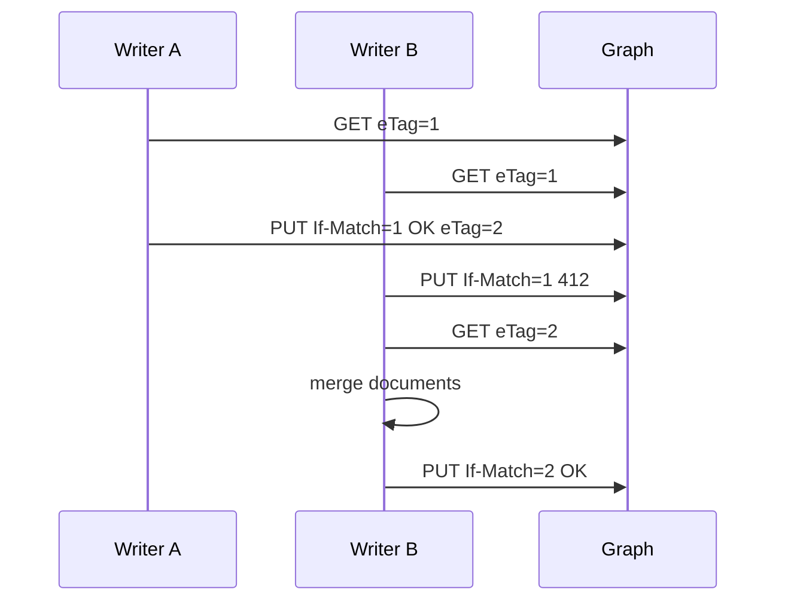
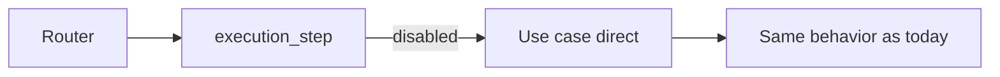

# Design: Execution Run Log

## 1. Audit of Deployed Backend

Before finalizing the design, an audit of the real deployed backend was performed to confirm the operational constraints:

| Componente | Implementación actual | Producción | Uso futuro en execution log |
|---|---|---|---|
| Backend de jobs | En memoria (`JobManager` en payment_validation.py y `_validation_jobs` en sharepoint.py) | Render (1 instancia) | Se mantiene. Se añadirá metadata de trace al dict en memoria. |
| Vercel Workflow | No utilizado (0 referencias) | No aplica | N/A |
| Vercel Blob | No utilizado (0 referencias) | No aplica | N/A |
| JobManager | Instanciado por request, usa dict global en memoria | Render (1 instancia) | Se mantiene. El wrapper agregará trazabilidad. |
| `sharepoint._validation_jobs`| Dict global protegido con `asyncio.Lock` | Render (1 instancia) | Se mantiene igual que JobManager. |
| Backend de locks | Python `asyncio.Lock` local en memoria | Render (1 instancia) | Se mantiene el lock local, complementado con reserva condicional vía Graph. |
| Compatibilidad legacy | Activa | Render | Se mantiene. El flag controla la generación del log. |

*Nota sobre multi-instancia:* No existe un lock distribuido (ej. Redis). Se usará una reserva condicional en Graph como garantía distribuida best-effort, documentando esta limitación.

## Technical Approach

Implement consolidated JSON audit in `04 LOGS` behind `EXECUTION_RUN_LOG_ENABLED` (default `false`). One `execution_id` = one file across Generate→Apply. All recording is automatic from routers, job runners, `GET /jobs/{job_id}`, and use cases via a thin wrapper—Power Automate unchanged. Core: `execution_run_log.py` (persistence + merge + summary); `execution_context.py` (immutable context); `execution_step.py` (wrapper); `execution_log_sanitizer.py` (sanitize + truncate). Financial logic, HTTP contracts, control operational states, and canonical manifest path remain untouched when flag is off.

---

## Architecture Decisions

| Decision | Choice | Alternatives | Rationale |
|----------|--------|--------------|-----------|
| OD-1 Lock | Local `asyncio.Lock` + Conditional Reservation file in Graph (`execution_run_reservation_{bank_code}.json` in `00 CONTROL/`) | Distributed lock (Redis) | No Redis exists. Use Graph eTag for cross-instance safety. File precreated by Setup; never deleted. |
| Reservation order | Init JSON → update control → enqueue job | Control first | JSON orphan recoverable; control without JSON breaks correlation |
| Models | `@dataclass` + `StrEnum` | Pydantic models | Matches `ProcessControlSnapshot`, `MergeCompositeValidadoPdfsResult` |
| Job stores | Additive fields on both `JobManager` and `sharepoint._validation_jobs` via helper | Single job registry refactor | Minimizes blast radius |
| Terminal dedup | Wrapper skips if terminal exists; `event_id` dedup as backstop | Dedup only | Prevents double terminal from wrapper + polling |
| eTag | Extend `put_bytes(..., if_match=None)` + `get_drive_item_metadata` | Always overwrite | Spec NFR-3; Graph returns `eTag` on driveItem GET |

---

## Module Layout

```
app/application/services/
  execution_run_log.py      # persistence, record_execution_event, merge, summary, reconstruct, polling repair
  execution_context.py      # ExecutionContext, create_execution_invocation_context, reservation helpers
  execution_step.py         # execution_step async context manager + TraceHandle
  execution_log_sanitizer.py# sanitize_for_execution_log, truncate_collection
  execution_bank_lock.py    # per-bank asyncio locks (new, small)
app/application/config/payment_validation_settings.py  # execution_run_log_enabled()
```

**Consolidation:** Keep four modules + small lock module. Do not merge sanitizer into main file (testability). `execution_bank_lock.py` avoids bloating `execution_context.py`.

---

## Models and Types

Use `enum.StrEnum` for statuses; frozen dataclasses for context; plain dict for persisted document validated on read.

```python
class ExecutionEventStatus(StrEnum):
    REQUEST_RECEIVED = "REQUEST_RECEIVED"
    REQUEST_REJECTED = "REQUEST_REJECTED"
    QUEUED = "QUEUED"
    STARTED = "STARTED"
    CHECKPOINT = "CHECKPOINT"
    SUCCEEDED = "SUCCEEDED"
    FAILED = "FAILED"
    BLOCKED = "BLOCKED"
    PARTIAL = "PARTIAL"
    COMPLETED_WITH_WARNINGS = "COMPLETED_WITH_WARNINGS"
    SKIPPED_IDEMPOTENT = "SKIPPED_IDEMPOTENT"
    ALREADY_COMPLETED = "ALREADY_COMPLETED"

class OverallStatus(StrEnum):
    RUNNING = "RUNNING"
    WAITING_FOR_NEXT_STEP = "WAITING_FOR_NEXT_STEP"
    SUCCEEDED = "SUCCEEDED"
    FAILED = "FAILED"
    BLOCKED = "BLOCKED"
    PARTIAL = "PARTIAL"
    COMPLETED_WITH_WARNINGS = "COMPLETED_WITH_WARNINGS"

@dataclass(frozen=True)
class ExecutionContext:
    execution_id: str
    execution_log_path: str
    invocation_id: str
    job_id: str
    step: str
    substep: str | None
    attempt: int
    bank_code: str
    process_date: str | None
    process_id: str | None = None
    process_key: str | None = None

@dataclass(frozen=True)
class ExecutionError:
    error_code: str
    exception_type: str | None
    technical_message: str
    user_message: str | None = None
    next_action: str | None = None

@dataclass(frozen=True)
class ExecutionArtifact:
    role: str
    path: str
    file_name: str
    action: str
    status: str
    client: str | None = None
    credit: str | None = None
    application_type: str | None = None
    size_bytes: int | None = None
    sha256: str | None = None

@dataclass(frozen=True)
class AffectedEntity:
    client: str
    credit: str
    application_type: str
    status: str
    missing_documents: tuple[str, ...] = ()
    warnings: tuple[str, ...] = ()
    errors: tuple[str, ...] = ()

@dataclass
class ExecutionLogWriteResult:
    ok: bool
    revision: int | None
    write_status: str
    warning: str | None = None
```

`ExecutionLogDocument` = typed dict shape validated by `validate_execution_log_document(doc) -> ExecutionLogDocument`. Reconstructed docs set `reconstructed: true`. Dates serialized ISO-8601 UTC via existing `utc_now_iso()` pattern.

`ManifestSnapshot`, `PollingObservation`, `ExecutionSummary`, `LoggingHealth` as dataclasses mapped to JSON sub-objects.

---

## Feature Flag

```python
def execution_run_log_enabled() -> bool:
    return os.getenv("EXECUTION_RUN_LOG_ENABLED", "false").strip().lower() in ("1", "true", "yes")
```

When `false`: all public functions return immediately (`ExecutionLogWriteResult(ok=True, write_status="DISABLED")`); wrappers yield no-op `TraceHandle`; no Graph calls for logging; zero meaningful latency.

---

## Generate Reservation (Atomic Flow)

**Reservation states** live only in JSON under `reservation.status` (`RESERVED` → `LOG_INITIALIZED` → `JOB_QUEUED`). **Not** in `EstadoProceso`.

### Sequence (`POST /generate/queue`, flag on)

```mermaid
sequenceDiagram
    participant PA as Power Automate
    participant R as queue_generate
    participant BL as BankExecutionLock
    participant J as JobManager
    participant EL as execution_run_log
    participant C as Control Excel
    participant BG as Background Task

    PA->>R: POST generate/queue
    R->>J: try_start_generate (existing global)
    R->>BL: acquire(bank_code)
    R->>C: read_process_control_snapshot
    alt already_generated same process_key
        R->>EL: append SKIPPED_IDEMPOTENT to existing log
        R->>J: enqueue with existing execution context
    else active process (use case will fail)
        Note over R: No new execution_id; may REQUEST_REJECTED if ExecutionId present
    else new execution
        R->>R: execution_id = uuid4()
        R->>EL: initialize_execution_log (LOG_INITIALIZED)
        R->>C: update ExecutionId + ExecutionLogPath
        R->>J: set_job + trace fields
        R->>EL: mark JOB_QUEUED event
        R->>BG: add_task(_run_generate_job)
    end
    R->>BL: release (finally)
    R->>J: finish_generate in runner finally (existing)
```

### Partial failure recovery

| Failure point | Control | JSON | Job | Recovery |
|---------------|---------|------|-----|----------|
| Init JSON fails | technical columns best-effort | absent | enqueue proceeds | Un fallo del execution log NO debe fallar Generate. Se marca `WRITE_FAILED`, se emite warning y se continúa. |
| Control update fails after JSON | stale | exists `LOG_INITIALIZED` | enqueue proceeds | Generate se encola. El job conserva execution_id y execution_log_path en metadata. Se reintenta vínculo al finalizar. |
| Enqueue fails after reservation | updated | exists | absent | Liberar lock. Registrar REQUEST_REJECTED o FAILED si el log existe. No marcar la ejecución como activa operativamente. Limpiar/expirar columnas técnicas reservadas. |
| Render restart mid-reservation | may be partial | may be partial | lost | Reconstruct from control if ExecutionId set; else new Generate |

**Política definitiva ante fallo del log:** 
Un fallo exclusivo del execution log NUNCA debe devolver 500 ni fallar Generate. El resultado financiero debe preservarse. Si falla la creación del JSON:
- Marcar `execution_log_status=WRITE_FAILED`.
- Registrar un warning estructurado.
- Intentar escribir las columnas técnicas de control (best-effort). Si también fallan, continuar de todos modos.
- Permitir reconstrucción posterior (las columnas técnicas no son requisito de negocio estricto para operar).

**Escenarios corregidos:**

### JSON creado, columnas técnicas fallan

- Generate se encola.
- El job conserva `execution_id` y `execution_log_path` en metadata.
- Al finalizar Generate se reintenta actualizar las columnas vía `ensure_execution_control_link`.
- Si falla nuevamente: `WRITE_FAILED/PARTIAL` y `possible_gaps=true`.

### JSON falla, columnas técnicas se escriben

- Generate se encola.
- El endpoint posterior reconstruye el log usando el control.

### JSON y columnas técnicas fallan

- Generate se encola como hoy.
- Job root indica `execution_log_status=WRITE_FAILED`.
- No se garantiza correlación downstream.
- **No inventar eventos.**
- Render conserva warning estructurado.

### Enqueue falla después de reserva

- Liberar el lock.
- Registrar `REQUEST_REJECTED` o `FAILED` si el log existe.
- **No marcar la ejecución como activa operativamente** si el job nunca fue encolado.
- Definir la limpieza o expiración de las columnas técnicas reservadas.

**Rule:** Proceder con enqueue incluso si falla la escritura del JSON o control, preservando el negocio.

### Reintento de vínculo del control (`ensure_execution_control_link`)

Función best-effort que vincula `ExecutionId`/`ExecutionLogPath` en el control cuando faltó inicialmente:

```python
async def ensure_execution_control_link(
    graph: GraphApiPort,
    site_id: str, drive_id: str,
    bank_code: str,
    execution_id: str,
    execution_log_path: str,
) -> bool:
    """
    Best-effort: escribe ExecutionId y ExecutionLogPath en el control
    si aún no están presentes. Retorna True si el vínculo existe
    (ya estaba o se escribió). False si falló.
    No modifica columnas operativas existentes.
    """
    ...
```

**Debe ejecutarse en:**
- Durante la reserva (primer intento).
- Al finalizar Generate (si el primer intento falló).
- Al consultar un job terminal, cuando falte el vínculo.
- Antes de un endpoint downstream, si el contexto está disponible.

**No modifica columnas operativas existentes.**

**Idempotency check before reserve:** Read control; if `already_generated` path (same `process_key` + validation path)—resolve existing `ExecutionId`/`ExecutionLogPath`; **no** new file; append `SKIPPED_IDEMPOTENT` (maps to `already_generated: true` in Generate result).

**Active process:** `active_process_exists` in use case—router may append `REQUEST_REJECTED` to active log when `ExecutionId` on control matches active run.

---

## Lock (OD-1 Resolved)

```python
# execution_bank_lock.py
_bank_locks: dict[str, asyncio.Lock] = {}
_registry_lock = asyncio.Lock()

async def acquire_bank_execution_lock(bank_code: str) -> asyncio.Lock:
    ...
```

| Property | Value |
|----------|-------|
| Key | `bank_code` normalized (`banco_bogota`, `banco_bancolombia`) |
| Duration | Held only during `queue_generate` reservation block (~seconds). **No se mantiene durante toda la ejecución de Generate.** |
| Release | `finally` after enqueue or early return. Escritura condicional: `locked=false, owner_*=null`. **No se elimina el archivo.** |
| Timeout | None (async wait); Graph ops have own timeouts |
| Protects | Single-writer reservation per bank on one instance |
| Multi-instance | **Reserva Condicional Distribuida** vía archivo `execution_run_reservation_{bank_code}.json` en `00 CONTROL/` |
| Defense in depth | Adquisición optimista con eTag, TTL de reserva. Si falla, fail-closed ante dos reservas concurrentes. |

### Archivo de Reserva

**Nombre y ubicación:**
- `execution_run_reservation_banco_bogota.json` → `00 CONTROL/`
- `execution_run_reservation_banco_bancolombia.json` → `00 CONTROL/`

Estos archivos son de coordinación técnica, no logs de ejecución. El carácter `:` NO es válido en OneDrive/SharePoint; se usa `_` como separador.

**Precreación en Setup:** `setup_merge_control_workbook` crea idempotentemente estos archivos si no existen:

```json
{
  "schema_version": 1,
  "bank_code": "banco_bogota",
  "locked": false,
  "owner_execution_id": null,
  "owner_invocation_id": null,
  "acquired_at": null,
  "expires_at": null,
  "revision": 0
}
```

Si el archivo ya existe, Setup NO lo sobrescribe (idempotente).

### Mecanismo de Lock Distribuido

**Adquisición realmente condicional:**

1. Leer archivo de reserva + eTag (via `get_drive_item_metadata` + `get` del contenido).
2. Evaluar `locked` y `expires_at`.
3. Si está libre (`locked=false`) o vencido (`expires_at < now`): construir nueva reserva.
4. `PUT` con `If-Match` del eTag leído.
5. Si Graph devuelve 412 Precondition Failed:
   - Releer archivo y eTag.
   - Volver a evaluar `locked` y `expires_at`.
   - Reintentar con límite (max 3 intentos).
   - **No asumir automáticamente que debe abortarse** tras un 412.
6. Si el lock sigue ocupado y no expiró:
   - Mantener el comportamiento `active_process_exists` o equivalente.
7. Si se agotan reintentos:
   - Fail-closed para la creación de una segunda ejecución.

**NO usar PUT sin If-Match como mecanismo de adquisición.** Un PUT sin condición sobreescribiría silenciosamente la reserva de otro proceso.

**Prerequisito de implementación:** Verificar mediante test de integración que la operación concreta usada por `MsGraphClient.put_bytes` respete `If-Match` en el endpoint `PUT /content` de Graph. Si no lo respeta, detener la implementación del lock distribuido y documentar una alternativa antes de activar el feature flag.

**Nota sobre el estado actual:** `MsGraphClient.put_bytes` NO acepta `if_match` hoy. `GraphApiPort` tampoco lo define. Ambos deben extenderse. `get_drive_item_metadata` no existe en el codebase; debe crearse.

### Ciclo de Vida del Lock

```
lock (acquire)
→ leer control
→ decidir nuevo/reuso/rechazo
→ reservar execution_id
→ intentar inicializar log
→ intentar actualizar columnas técnicas
→ encolar job
→ liberar lock (release)
```

**No mantener el lock durante toda la ejecución de Generate.** No existe renovación por parte del runner.

### Semántica de TTL

- TTL: 5 minutos.
- El TTL solo permite recuperar una reserva abandonada si el proceso cae antes de liberarla.
- **La expiración es lógica:** el archivo NO se elimina automáticamente. La aplicación compara `expires_at` contra `utc_now()` al evaluar si la reserva está libre.
- **Liberación normal:** escritura condicional con `locked=false`, `owner_execution_id=null`, `owner_invocation_id=null`. No borrar el archivo.
- **No existe renovación durante Generate.**

Existing `JobManager.try_start_generate()` remains (global generate/finalize mutex)—preserves current 409 behavior for PA.

---

## Control Excel

Add to end of `PROCESS_CONTROL_EXTENSION_COLUMNS`:

```python
"ExecutionId",
"ExecutionLogPath",
```

| Aspect | Design |
|--------|--------|
| Position | Al final de la tabla (append-only) |
| Type | string text cells |
| Setup | `setup_merge_control_workbook` repara columnas y aplica protecciones |
| Visibilidad | **Ocultas** y **Bloqueadas/Protegidas** (no editables por la secretaria) |
| Snapshot | `ProcessControlSnapshot.execution_id`, `execution_log_path` |
| Soporte | Disponibles para automatización y soporte técnico (Graph/openpyxl pueden leer columnas ocultas) |
| Clear/replace | New execution: overwrite both on reservation; retries: unchanged |
| Operational columns | Untouched |

---

## Invocation Context and Attempt

```python
async def reserve_execution_invocation(
    graph, site_id, drive_id, *,
    execution_id, execution_log_path, job_id, step, substep, bank_code, process_date, ...
) -> ExecutionContext:
    """
    Reserva atómica de attempt en una sola operación optimista:
    1. Lee JSON + eTag.
    2. Calcula siguiente attempt (basado en eventos previos del mismo step).
    3. Genera invocation_id.
    4. Agrega evento de reserva (REQUEST_RECEIVED o QUEUED).
    5. Guarda JSON con If-Match (eTag).
    6. Ante 412, relee y recalcula (loop optimista).
    7. Devuelve ExecutionContext definitivo.
    """
    pass
```

Terminal event uses **same** `invocation_id`, `job_id`, `attempt` from context created at step entry (before `STARTED`).

---

## Job Metadata (In-Memory)

Additive keys on job dict (both `JobManager` and `sharepoint._validation_jobs`):

```python
EXECUTION_TRACE_KEYS = (
    "execution_id", "execution_log_path", "invocation_id",
    "attempt", "execution_step", "execution_substep",
    "execution_log_status", "execution_log_warning",
    "_poll_meta",  # internal: {poll_count, last_status, statuses: {...}}
)
```

Helper: `attach_execution_trace(job: dict, context: ExecutionContext, write_result: ExecutionLogWriteResult | None)`.

After Render restart: recover `execution_id` from control via `bank_code` in job `request` or result; `_poll_meta` lost (acceptable per spec).

---

## Public API (`execution_run_log.py`)

```python
async def initialize_execution_log(...) -> ExecutionLogWriteResult
async def record_execution_event(graph, context, status, **kwargs) -> ExecutionLogWriteResult
async def reconstruct_execution_log_from_control(...) -> ExecutionLogWriteResult
async def record_job_poll(graph, context, job_snapshot, poll_meta) -> ExecutionLogWriteResult | None
async def ensure_terminal_job_event_logged(graph, job: dict) -> ExecutionLogWriteResult | None

def recompute_execution_summary(document: dict) -> dict
def classify_terminal_event(step, result, error) -> ExecutionEventStatus
def merge_execution_documents(base: dict, incoming: dict) -> dict
```

Use cases **never** mutate JSON directly.

---

## Wrapper `execution_step`

```python
@asynccontextmanager
async def execution_step(
    graph: GraphApiPort,
    context: ExecutionContext,
    *,
    site_id: str,
    drive_id: str,
):
    trace = TraceHandle(graph, context, site_id, drive_id)
    if execution_run_log_enabled():
        if not trace.has_terminal_for_invocation():
            await record_execution_event(..., STARTED)
    try:
        yield trace
    except Exception as exc:
        if execution_run_log_enabled() and not trace.terminal_recorded:
            await record_execution_event(..., FAILED, error=from_exception(exc))
        raise
```

`TraceHandle.checkpoint(label, **meta)` → `CHECKPOINT` event.

`complete_from_result(result)` → `classify_terminal_event` → single terminal; sets `terminal_recorded=True`.

**Double terminal prevention:** (1) `has_terminal_for_invocation()` before STARTED; (2) `terminal_recorded` flag on handle; (3) `event_id` dedup on write.

---

## Terminal Event Classification

Pure `classify_terminal_event(step, result, error)`:

| Step | Result signal | Event status |
|------|---------------|--------------|
| GENERATE | success, not `already_generated` | SUCCEEDED |
| GENERATE | `already_generated: true` | SKIPPED_IDEMPOTENT |
| GENERATE | exception | FAILED |
| FINALIZE | success, not `already_finalized` | SUCCEEDED |
| FINALIZE | `already_finalized: true` | ALREADY_COMPLETED |
| FINALIZE | validation error | FAILED |
| NOTIFY | ok, control updated | SUCCEEDED |
| NOTIFY | `already_notified` / warning code | ALREADY_COMPLETED |
| NOTIFY | email ok + `merge_control_updated: false` | COMPLETED_WITH_WARNINGS |
| MERGE | `CONSOLIDADO` | SUCCEEDED |
| MERGE | `MERGE_PARCIAL` | PARTIAL |
| MERGE | gate block | BLOCKED |
| MERGE | `already_merged: true` | ALREADY_COMPLETED |
| MERGE | exception | FAILED |
| DRY_RUN | `can_apply: true` | SUCCEEDED |
| DRY_RUN | warnings only | COMPLETED_WITH_WARNINGS |
| DRY_RUN | `can_apply: false` | BLOCKED |
| APPLY | status ok | SUCCEEDED |
| APPLY | partial | PARTIAL |
| APPLY | gate / preflight | BLOCKED |
| APPLY | `already_applied: true` | ALREADY_COMPLETED |
| APPLY | exception | FAILED |

Internal Apply dry-run: `step=APPLY`, `substep=DRY_RUN`.

---

## Summary Recomputation

Pure `recompute_execution_summary(document)`:

**Priority (highest wins for `overall_status`):** `SUCCEEDED` (flow complete) > `FAILED`/`BLOCKED` (if no later success on same step) > `PARTIAL` > `COMPLETED_WITH_WARNINGS` > `RUNNING` > `WAITING_FOR_NEXT_STEP`.

**Reglas y Precedencia:**
- Un retry exitoso supera el fallo anterior del mismo paso (limpia `failed_step`).
- `failed_step` representa solo un fallo *vigente*.
- `STARTED` sin terminal coloca `RUNNING` **solo antes del cierre** definitivo.
- `BLOCKED`/`PARTIAL` indican la etapa actual y acción pendiente.
- `last_terminal_event_at`: max `finished_at` of terminal events.
- `last_activity_at`: max timestamp any event.

**Eventos posteriores al cierre (Post-completion):**
- Cuando APPLY cierra exitosamente, el `overall_status` **debe permanecer `SUCCEEDED`**.
- `flow_completed_at` debe conservarse intacto.
- Invocaciones posteriores se registran, incrementando `post_completion_events_count` en el summary.
- No reabren el flujo completo ni reemplazan el resultado final de negocio, salvo reapertura formal (fuera de alcance).

**Matriz WAITING_FOR_NEXT_STEP corregida:**

| Etapa completada | waiting_for                | next_expected_step |
| ---------------- | -------------------------- | ------------------ |
| GENERATE         | SECRETARY_REVIEW           | FINALIZE           |
| FINALIZE         | NOTIFY_EXECUTION           | NOTIFY             |
| NOTIFY           | ACCOUNTING_DOCUMENT_UPLOAD | MERGE              |
| MERGE            | DRY_RUN_EXECUTION          | DRY_RUN            |
| DRY_RUN listo    | APPLY_EXECUTION            | APPLY              |
| APPLY            | null                       | null               |

**Variantes de espera:**
- Notify con warning de control → Continúa a MERGE pero registra warning.
- Merge parcial → Status `PARTIAL`, waiting for MERGE (o resolución manual).
- Dry-run bloqueado → Status `BLOCKED`, requiere soporte técnico o acción previa.
- Apply parcial → Status `PARTIAL`, waiting for APPLY de los restantes.

**Given/When/Then del Summary:**
- *Given* un flujo cerrado en APPLY, *When* entra un evento Notify atrasado, *Then* el status sigue `SUCCEEDED` y `post_completion_events_count` += 1.
- *Given* un fallo en Merge, *When* un retry de Merge resulta exitoso, *Then* `failed_step` pasa a null y el flujo avanza.

---

## Graph / eTag

```python
# domain/ports/graph.py
async def put_bytes(..., if_match: str | None = None) -> dict[str, Any]

# ms_graph_client.py
if if_match:
    headers["If-Match"] = if_match
# 412 → raise GraphPreconditionFailedError

async def get_drive_item_metadata(graph, site_id, drive_id, rel_path) -> DriveItemMetadata:
    # GET /sites/.../root:/path:  → eTag, size, lastModifiedDateTime
```

**Write loop:** max 5 retries; backoff `0.2 * (2**n)` seconds capped 2s; on 412 merge documents; on 404 init if reconstructing; corrupt JSON → treat as empty + `possible_gaps`.

**eTag never stored in JSON.**

Graph `PUT /content` supports `If-Match` per Microsoft Graph driveItem documentation.

---

## Concurrent Merge Strategy

`merge_execution_documents(base, incoming)`:

1. Events: union by `event_id`; sort by `sequence`, then `started_at`; reassign `sequence` 1..N if conflict.
2. Artifacts: merge list by `artifact_id = role|normalized_path`; incoming wins on conflict.
3. Entities: key `client|credit|application_type`.
4. Metrics: per-key max of numeric or last-wins for strings (document in code).
5. `job_polling`: merge by `job_id`; merge `observed_statuses` counts.
6. Set `logging_health.possible_gaps = true` if merge detected overlapping sequences.
7. `recompute_execution_summary` on result.

---

## Reconstruction

`reconstruct_execution_log_from_control(graph, site_id, drive_id, bank_code)`:

Sources: `ExecutionId`, `ExecutionLogPath`, `ProcessId`, `ProcessKey`, `EstadoProceso`, job ID columns, paths (`ValidationFilePath`, etc.), `LastStepErrorCode`, bank, dates.

Output minimal doc with `reconstructed=true`, `possible_gaps=true`, empty `events[]`, populated `artifacts` from paths only, `logging_health.status=RECONSTRUCTED`.

**Forbidden:** fabricate events, timestamps, or success without evidence.

---

## Polling (`GET /jobs/{job_id}`)

Hook in `get_job_status`, `notify_validar_extractos_job_status`, `merge_composite_validado_pdfs_job_status` via shared `maybe_record_job_poll(job)`.

**In-memory `_poll_meta` on job:**

```python
{"poll_count": 8, "last_status": "running", "statuses": {"queued": {"count":1,...}, ...}}
```

**Política de Polling sin impacto (Timeouts):**
El polling de jobs es crítico en UI, no debe bloquearse por demoras de Graph.
- Primera consulta y Cambio de estado: Intentar persistir con **timeout corto (best-effort, ej. 500ms)**.
- Cada quinta consulta idéntica (`poll_count % 5 == 0`): Persistir con timeout muy corto (ej. 200ms).
- Estado Terminal: Intentar persistir y reparar el evento terminal con timeout normal (ej. 2s).
- Si Graph falla por timeout: Ignorar error y devolver de inmediato el estado real en memoria.
- **Presupuesto máximo de latencia**: Ningún GET /jobs/id debe sumar más de 500ms-2s de overhead por logging. Nunca usar fire-and-forget descontrolado.

**After restart:** counter resets; first poll persists again; transitions may lose intermediate identical polls (acceptable).

Then `ensure_terminal_job_event_logged(job)` if terminal and missing event.

---

## Terminal Repair

```python
async def ensure_terminal_job_event_logged(graph, job):
    if job["status"] not in ("completed", "failed"): return
    ctx = resolve_context_from_job_and_control(job)
    if terminal_exists(job_id, invocation_id): return
    status = classify_terminal_from_job(job)
    await record_execution_event(..., status, error/result sanitized from job)
```

### Resolución de `attempt` e `invocation_id` (sin recalcular)

**Orden de resolución:**
1. `attempt` e `invocation_id` de la metadata del job (trace fields en memoria).
2. Evento existente con el mismo `job_id` en el log.
3. Evento `QUEUED`/`STARTED` con el mismo `invocation_id`.

**Si no puede obtenerse una correlación segura:**
- **No crear evento terminal.**
- Registrar warning técnico.
- Marcar `possible_gaps=true` cuando pueda actualizarse el log.
- **No fabricar `attempt`, `invocation_id` ni eventos históricos.**

**Test requerido:**
```
Given job terminal sin trace metadata y sin evento correlacionable
When polling intenta reparar
Then no se agrega terminal inventado
And se registra una brecha de trazabilidad
```

**Verificación de backend real para Terminal Repair:**
Dado que existen dos almacenes en memoria separados (`JobManager` en `payment_validation` y `_validation_jobs` en `sharepoint`), el repair debe poder acceder al job si sigue en memoria.
- Si el job está persistido pero el servidor reinició: El endpoint de polling devuelve 404 (o se reconstruye desde SharePoint si está allí), perdiendo el `_poll_meta` (aceptable).
- Para evitar duplicación de lógica: Se requiere una función canónica compartida (ej. un helper unificado) que lea de ambos stores si es necesario, o que los routers inyecten su dict local al helper de polling.

---

## Checkpoints (controlled constants)

```python
class ExecutionCheckpoint(StrEnum):
    GENERATE_BANK_FILE_READ = "GENERATE_BANK_FILE_READ"
    GENERATE_WORKBOOK_UPLOADED = "GENERATE_WORKBOOK_UPLOADED"
    GENERATE_CONTROL_UPDATED = "GENERATE_CONTROL_UPDATED"
    FINALIZE_REVIEW_READ = "FINALIZE_REVIEW_READ"
    FINALIZE_VALIDATION_COMPLETED = "FINALIZE_VALIDATION_COMPLETED"
    FINALIZE_HISTORICAL_UPLOADED = "FINALIZE_HISTORICAL_UPLOADED"
    FINALIZE_SUPPORT_UPLOADED = "FINALIZE_SUPPORT_UPLOADED"
    NOTIFY_HISTORICAL_READ = "NOTIFY_HISTORICAL_READ"
    NOTIFY_EMAIL_SENT = "NOTIFY_EMAIL_SENT"
    NOTIFY_CONTROL_UPDATED = "NOTIFY_CONTROL_UPDATED"
    MERGE_PREVALIDATION_COMPLETED = "MERGE_PREVALIDATION_COMPLETED"
    MERGE_MANIFEST_UPLOADED = "MERGE_MANIFEST_UPLOADED"
    MERGE_CONTROL_UPDATED = "MERGE_CONTROL_UPDATED"
    DRY_RUN_MANIFEST_READ = "DRY_RUN_MANIFEST_READ"
    DRY_RUN_PLANNING_COMPLETED = "DRY_RUN_PLANNING_COMPLETED"
    APPLY_INTERNAL_DRY_RUN_COMPLETED = "APPLY_INTERNAL_DRY_RUN_COMPLETED"
    APPLY_TABLE_UPLOADED = "APPLY_TABLE_UPLOADED"
    APPLY_TABLE_VERIFIED = "APPLY_TABLE_VERIFIED"
    APPLY_IBR_WRITTEN = "APPLY_IBR_WRITTEN"
    APPLY_ACCOUNTING_PDF_MOVED = "APPLY_ACCOUNTING_PDF_MOVED"
    APPLY_CONTROL_UPDATED = "APPLY_CONTROL_UPDATED"
```

Emitir vía `trace.checkpoint(label, checkpoint_key=..., metrics=...)`.
El `event_id` de un checkpoint debe incluir: `checkpoint_label + checkpoint_key`.
Ejemplos de keys: `APPLY_TABLE_UPLOADED|cliente1|credito123`, `MERGE_OUTPUT_CREATED|id-grupo-4`.
Esto evita deduplicar eventos legítimos que comparten label pero aplican a créditos o entidades distintas.

---

## Artifacts and Entities

- `artifact_id = f"{role}|{normalize_path(path)}"`
- Root `artifacts[]`: latest per `artifact_id`
- Event carries `action` (`READ`, `CREATED`, …)
- Entity key: `client|normalize_credit(credit)|application_type`; missing client → `UNKNOWN_CLIENT`; missing type → `UNKNOWN`

Schema definitivo de colecciones truncadas (aplicable a artifacts, affected_entities, manifest outputs, incomplete_groups):

```json
{
  "items": [],
  "total_count": 0,
  "included_count": 0,
  "truncated": false
}
```

Las listas siempre deben estar encapsuladas en este wrapper; nunca representadas como listas directas en la raíz del objeto log, garantizando consistencia estructural unificada.

---

## Sanitization

Recursive `sanitize_for_execution_log(obj, depth=0, max_depth=8)`:

- Denylist keys (case-insensitive substring): `authorization`, `access_token`, `refresh_token`, `client_secret`, `password`, `api_key`, `excel_base64`, `pdf_base64`, `cookie`, `set-cookie`
- Max string 4000; max list scan 500 before truncation helper
- Bytes → `"<bytes>"`; exceptions → type name + message sanitized
- URLs: strip query tokens if `token=`/`access_token=`
- Preserve: paths, client, credit, file names, counts, error codes

---

## Logging Health

```json
"logging_health": {
  "status": "OK|PARTIAL|WRITE_FAILED|RECONSTRUCTED",
  "possible_gaps": false,
  "write_failures_count": 0,
  "last_write_error": null,
  "last_successful_write_at": null
}
```

If all writes fail, detail only in job root, Render logs, next reconstruction—**not** in JSON.

---

## Job Root Fields

Set on job dict whenever trace active:

`execution_id`, `execution_log_path`, `execution_log_status`, `execution_log_warning`

Present when `status=failed` and `result=null`. **202 responses unchanged.**

PA Parse JSON: `additionalProperties` tolerant—new optional root keys safe if PA only reads nested `result`.

---

## Hooks by File

| File | Function | Layer | Events |
|------|----------|-------|--------|
| `payment_validation.py` | `queue_generate` | Router | REQUEST_RECEIVED; reservation + QUEUED; SKIPPED path |
| `payment_validation.py` | `_run_generate_job` | Runner | STARTED via wrapper; terminal via wrapper/except |
| `payment_validation.py` | `queue_finalize` | Router | REQUEST_RECEIVED, QUEUED |
| `payment_validation.py` | `_run_finalize_job` | Runner | wrapper |
| `payment_validation.py` | `queue_amortization_dry_run` | Router | REQUEST_RECEIVED, QUEUED |
| `payment_validation.py` | `_run_amortization_dry_run_job` | Runner | wrapper step=DRY_RUN |
| `payment_validation.py` | `queue_amortization_apply` | Router | REQUEST_RECEIVED, QUEUED |
| `payment_validation.py` | `_run_amortization_apply_job` | Runner | wrapper; substep DRY_RUN inside use case checkpoint |
| `payment_validation.py` | `get_job_status` | Router | `record_job_poll` + `ensure_terminal` |
| `sharepoint.py` | `post_notify_*` | Router | REQUEST_RECEIVED, QUEUED |
| `sharepoint.py` | `_run_notify_*` | Runner | wrapper |
| `sharepoint.py` | `post_merge_*` | Router | REQUEST_RECEIVED, QUEUED |
| `sharepoint.py` | `_run_merge_*` | Runner | wrapper + manifest_snapshot on terminal |
| `sharepoint.py` | `*_job_status` GET | Router | poll + repair |
| `payment_validation_generate.py` | `generate_payment_validation` | Use case | checkpoints only (via trace passed in) |
| `payment_validation_finalize.py` | finalize | Use case | checkpoints |
| `send_validar_extractos_notification.py` | notify | Use case | checkpoints |
| `merge_composite_validado_pdfs.py` | merge | Use case | checkpoints + build manifest_snapshot |
| `amortization_fill_dry_run.py` | dry_run | Use case | checkpoints |
| `amortization_fill_apply.py` | apply | Use case | checkpoints |

Context resolution: each runner loads control after `bank_code` known → `create_execution_invocation_context`.

409 on generate: if active `ExecutionId`, append `REQUEST_REJECTED` before raising.

422 validation: global handler logs `request_id` to Render only—no execution log without correlation.

404 job: Render warning; if job trace in partial store, warn execution log.

---

## Sequence Diagrams

### Finalize fail then retry

```mermaid
sequenceDiagram
    participant U as Secretary/PA
    participant F as Finalize
    participant L as execution_log.json

    U->>F: attempt 1
    F->>L: STARTED attempt=1
    F->>L: FAILED attempt=1
    U->>F: attempt 2
    F->>L: STARTED attempt=2
    F->>L: SUCCEEDED attempt=2
    Note over L: summary.failed_step cleared; events retain both
```

### eTag conflict



### Flag false



---

## Implementation Phases

| Phase | Deliverable | Flag |
|-------|-------------|------|
| A | Models, sanitizer, service, eTag, unit tests | off |
| B | Control columns, snapshot, setup tests | off |
| C | Bank lock, Generate reservation, Finalize hooks | off |
| D | Notify, Merge + manifest_snapshot | off |
| E | Dry-run, Apply + checkpoints | off |
| F | Polling + terminal repair | off |
| G | Smoke flag=true per bank | on in validation |

Each phase: full `pytest` green.

---

## Testing Strategy

| Layer | Focus |
|-------|--------|
| Unit | `recompute_execution_summary`, `classify_terminal_event`, `merge_execution_documents`, `compute_attempt`, sanitizer, dedup, truncation |
| Unit | eTag retry with fake Graph (412 simulation) |
| Integration | Fake Graph round-trip init→append→read |
| Regression | Flag false: no Graph logging calls (mock assert) |
| Regression | Manifest path unchanged; control states unchanged; Feature flag false no realiza operaciones extra |
| Scenarios | All 28 spec scenarios + wrapper re-raises; no double terminal; summary after retry |
| Diseño | 1. Dos llamadas concurrentes a Merge reservan attempts distintos. |
| Diseño | 2. Dos checkpoints iguales para créditos distintos no se deduplican. |
| Diseño | 3. Log init fallido no falla Generate. |
| Diseño | 4. Control técnico fallido no falla Generate. |
| Diseño | 5. Ejecución completada permanece SUCCEEDED tras llamada posterior. |
| Diseño | 6. Polling lento no retrasa indebidamente GET (timeout cumplido). |
| Diseño | 7. Columnas técnicas ocultas siguen siendo legibles. |
| Diseño | 8. Backend real de jobs permite terminal repair desde ambos stores en memoria. |
| Diseño | 9. Reserva condicional (eTag) evita doble ejecución entre instancias. |
| Diseño | 10. Matriz WAITING coincide con el flujo real. |
| Diseño | 11. Estructura TruncatedList es consistente en artifacts y entidades. |
| Diseño | 12. Nombre de lock sin caracteres inválidos (`:` prohibido en OneDrive/SharePoint). |
| Diseño | 13. Setup precrea exactamente un archivo de reserva por banco. |
| Diseño | 14. Dos adquisiciones concurrentes: solo una obtiene el lock. |
| Diseño | 15. 412 provoca relectura y reevaluación (no abort inmediato). |
| Diseño | 16. Lock vencido se recupera condicionalmente. |
| Diseño | 17. Release no elimina el archivo de reserva. |
| Diseño | 18. No existe renovación durante Generate. |
| Diseño | 19. Fallo de columnas técnicas no impide enqueue. |
| Diseño | 20. Al finalizar Generate se reintenta el vínculo del control via `ensure_execution_control_link`. |
| Diseño | 21. Terminal repair no recalcula attempt (usa resolución por prioridad). |
| Diseño | 22. Terminal no correlacionable no se fabrica; se registra brecha. |
| Diseño | 23. If-Match se valida sobre el endpoint Graph exacto (`PUT /content`). |
| Diseño | 24. Feature flag false no crea ni consulta archivos de reserva. |
| Diseño | 25. Enqueue fallido libera la reserva y no deja proceso operativo activo. |

---

## Rollout / Rollback

1. Deploy `EXECUTION_RUN_LOG_ENABLED=false`
2. Validation env `true`; one full flow per bank
3. Monitor: `write_failures_count`, 412 retries, reconstructions, mean JSON size, p95 job latency delta, repaired terminals
4. Production `true` after sign-off

Rollback: `false` + redeploy; JSON files inert.

---

## Open Questions (Closed)

| ID | Decision |
|----|----------|
| OD-1 | Per-bank asyncio lock + control + eTag |
| OD-2 | No runtime `ABANDONED` in v1 |
| OD-3 | `power_automate_run_id` null until optional header |
| OD-4 | 422 handler on `payment_validation` + `sharepoint` routers only |

---

## Residual Risks

- Multi-instance Render: dos reservas del mismo banco posibles si Graph tiene latencia alta — mitigar con lectura de control en cada paso; puede producir JSON huérfano (soporte usa timestamps).
- Very large `events[]` over years — no truncation; retention policy future.
- Orphan JSON if control update fails — reconstruct path documented; `ensure_execution_control_link` mitiga parcialmente.
- `_poll_meta` lost on restart — acceptable per spec.
- **`MsGraphClient.put_bytes` no soporta `if_match` hoy.** Se debe extender antes de implementar el lock distribuido. Si `PUT /content` no respeta `If-Match`, el lock distribuido no es viable y debe documentarse una alternativa.
- **`get_drive_item_metadata` no existe en el codebase.** Debe crearse como parte de Phase A.
- **`checkpoint_key` eliminado de `ExecutionContext`.** Si algún consumidor externo dependía de él a nivel de invocación, será una ruptura. Revisado: no hay consumidores externos hoy.

---

## Verdict

**Ready for `/sdd-tasks`** — arquitectura, APIs, hooks y modos de fallo están especificados para implementación incremental detrás de feature flag sin tocar PA ni contratos financieros.

**Correcciones aplicadas en esta revisión:**
1. Nombre de archivos de reserva sin `:` (inválido en OneDrive/SharePoint).
2. Precreación idempotente de archivos de reserva en Setup.
3. Adquisición realmente condicional (read eTag → evaluate → PUT If-Match → handle 412 con retry).
4. Alcance del lock limitado a la reserva (no durante toda la ejecución).
5. Tabla de fallos parciales corregida con escenarios detallados.
6. `ensure_execution_control_link` como función best-effort de reintento.
7. Terminal repair sin recalcular `attempt` (resolución por prioridad).
8. `checkpoint_key` eliminado de `ExecutionContext` (pertenece a cada evento `CHECKPOINT`).
9. 14 tests adicionales agregados al diseño.

## File Changes (Summary)

| File | Action |
|------|--------|
| `execution_run_log.py` | Create |
| `execution_context.py` | Create |
| `execution_step.py` | Create |
| `execution_log_sanitizer.py` | Create |
| `execution_bank_lock.py` | Create |
| `graph.py` / `ms_graph_client.py` | Modify (If-Match + `get_drive_item_metadata`) |
| `payment_validation_settings.py` | Modify (flag) |
| `setup_merge_control_workbook.py` | Modify (columns + precreate reservation files) |
| `payment_validation_process_control.py` | Modify (snapshot + `ensure_execution_control_link`) |
| `payment_validation.py` | Modify (hooks) |
| `sharepoint.py` | Modify (hooks) |
| 6 use cases | Modify (checkpoints via trace) |
| `tests/test_execution_run_log*.py` | Create |
